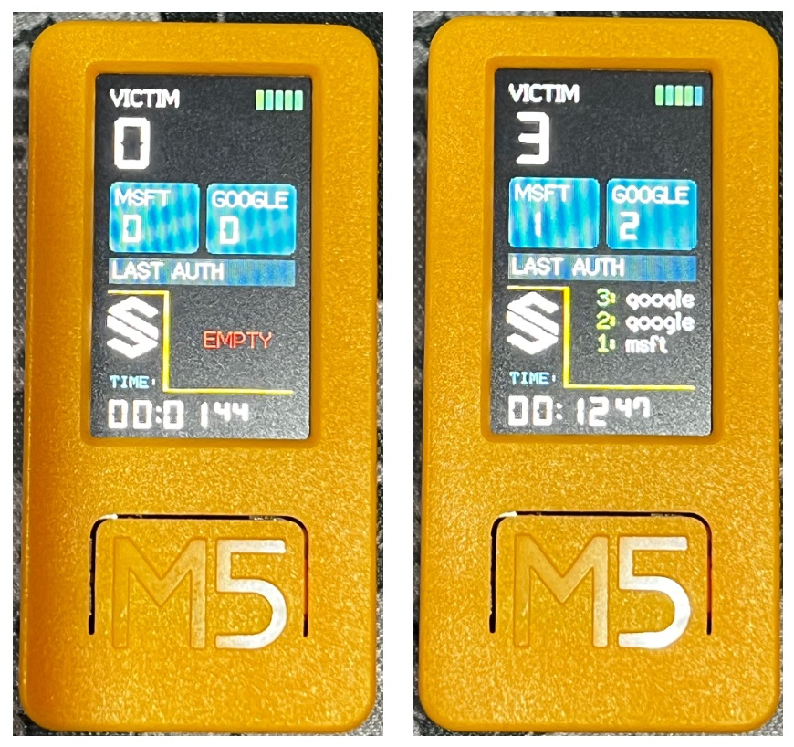

# Fake Captive Portal :: M5 Stick C Plus / M5 Stick C Plus 2 / M5 Cardputer
`DISCLAIMER: This is for educational purposes only. Extracting passwords from unaware victims is illegal`

## Default parameters

* [X] Microsoft portal `Enabled`
* [X] Google portal `Enabled`
* [X] Default SSID: `Free Wifi`

You can change this default parameters throught URL http://127.0.0.1/config

## Story

A Wi-Fi honeypot is a fake wireless network that is set up to lure unsuspecting users and collect their data or infect their devices with malware. It is a common technique used by hackers and cybercriminals to exploit the public’s demand for free Wi-Fi access.

# PTBR - 🇧🇷

Projeto com o intuito de ser apenas educacional, não me responsabilizando pelos atos cometidos por terceiros, o código esta configurado com um exemplo.